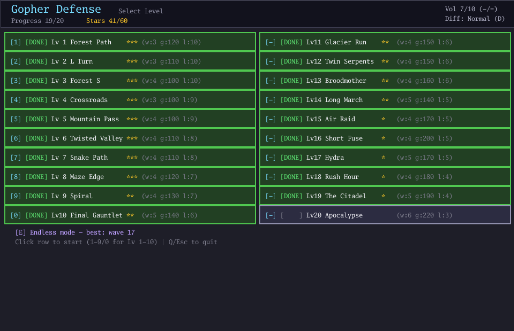
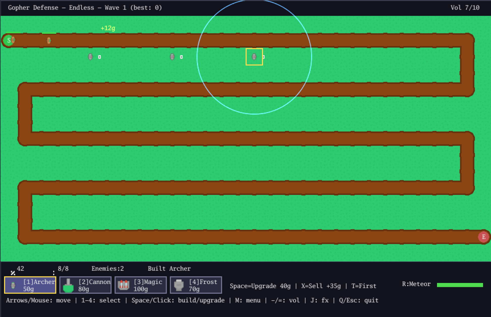
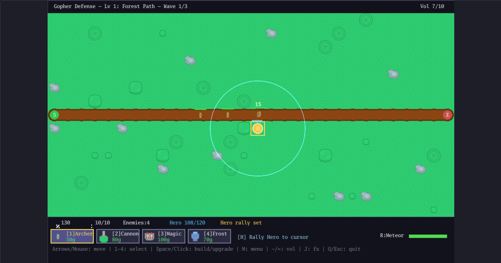
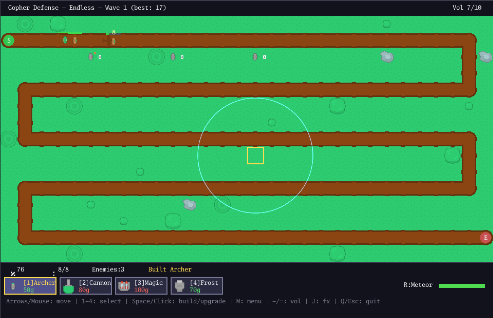

# Gopher Defense

[](https://github.com/Corray/kingdom-rush/actions/workflows/deploy-pages.yml)
[](https://corray.github.io/kingdom-rush/)
[](LICENSE)

A tower defense game written in Go — playable on **desktop**, in the **terminal**, and in your **browser** (WASM).

> Inspired by Kingdom Rush (Ironhide Game Studio). This is a non-commercial,
> educational project and is not affiliated with or endorsed by Ironhide.
> All art and audio assets are CC0 (see [Credits](#credits)).

**▶ Play in browser:** https://corray.github.io/kingdom-rush/






## Features

- **20 handcrafted levels** with escalating difficulty and themed wave design
- **4 tower types** — Archer, Cannon (AoE splash), Magic, Frost (slow) — each with 3 upgrade levels
- **5 enemy types** — Normal, Fast, Glider (flying, cannons can't hit), Boss, Spawner (summons on death)
- **Hero unit** — a controllable champion: press `H` to rally it anywhere on the map. It auto-attacks nearby enemies, falls when overwhelmed, and respawns after a cooldown. Fliers slip past it. It **levels up through each battle** (kills grant XP → more HP / damage / range, healing on level-up) and unlocks a **cleave** ability (`G`) at level 3.
- **3 hero classes** — pick your champion in the menu (`H`): **Knight** (gold, tanky melee, blocks foes at chokepoints), **Archer** (green, long-range kiter, doesn't block), **Rogue** (purple, fast skirmisher that catches runners, blocks, quick respawn). Each has its own stats, growth curve, and cleave flavor.
- **Skill trees** — spend the stars you earn from level ratings on permanent per-class perks (menu `T`). Four nodes per class, and the three trees cost more than you can ever earn — pick your build.
- **Tactical depth** — sell towers (70% refund), per-tower targeting strategies (First / Last / Strong), meteor strike active ability with cooldown
- **3 difficulty settings** (Normal / Hard / Easy) and **3-star ratings** per level
- **Endless mode** — budget-based procedural waves, survive as long as you can, best-wave record
- **Full audio** — SFX + chiptune BGM with volume control (all CC0)
- **Game feel** — smooth enemy movement, damage popups, screen shake, hit-stop (toggleable)
- Save progress persists across sessions (file on desktop, localStorage in browser)

## Controls

| Key | Action |
|-----|--------|
| `Arrows` / mouse hover | Move cursor |
| `1` `2` `3` `4` | Select tower type (Archer / Cannon / Magic / Frost) |
| `Space` / left click | Build or upgrade tower at cursor |
| `X` / right click | Sell tower (70% refund) |
| `T` | Cycle targeting strategy of tower at cursor |
| `H` | Rally hero to cursor (auto-fights & blocks ground enemies; respawns on death) |
| `G` | Hero cleave — AoE burst around the hero (unlocks at hero level 3) |
| `R`, then click | Meteor strike (25s cooldown); `R` again cancels |
| `P` | Pause / resume |
| `F` | Toggle game speed (1x / 2x) |
| `M` | Back to menu |
| `D` | Cycle difficulty (in menu) |
| `H` | Cycle hero class — Knight / Archer / Rogue (in menu) |
| `T` | Skill trees — spend stars on permanent hero perks (in menu) |
| `E` | Endless mode (in menu) |
| `-` / `=` | Volume down / up |
| `J` | Toggle screen effects (shake / hit-stop) |
| `Q` / `Esc` | Quit |

## Build & Run

Requires Go ≥ 1.24.

```sh
# Desktop (Ebiten)
go run .

# Terminal mode (tcell, the original V1 experience)
go build -tags term -o gopher-defense-term . && ./gopher-defense-term

# Browser (WASM) — builds web/ and serves at :8080
make serve
```

Run tests:

```sh
go test ./...
```

## Save data

| Platform | Location |
|----------|----------|
| Desktop | `~/.kingdom-rush/save.json` |
| Browser | localStorage key `kingdom-rush-save` (per origin) |

(Paths keep the repository's historical name so existing saves survive upgrades.)

## Credits

All third-party assets are **CC0** (public domain); attribution is voluntary:

| Asset | Source | License |
|-------|--------|---------|
| Sprites | [Kenney — Tower Defense Top-Down](https://kenney.nl/assets/tower-defense-top-down) | CC0 |
| SFX | Kenney — [Interface Sounds](https://kenney.nl/assets/interface-sounds) / [Impact Sounds](https://kenney.nl/assets/impact-sounds) / [Digital Audio](https://kenney.nl/assets/digital-audio) | CC0 |
| BGM | [Juhani Junkala — 4 Chiptunes (Adventure)](https://opengameart.org/content/4-chiptunes-adventure) | CC0 |
| Font | Go Mono (golang.org/x/image/font/gofont) | BSD-style (Go font license) |

Per-file mappings live next to the assets: `assets/sprites/LICENSE-Kenney.txt`,
`assets/sfx/LICENSE-Kenney-audio.txt`, `assets/bgm/LICENSE-JuhaniJunkala.txt`.

## Version history

| Tag | Era |
|-----|-----|
| `v1.0` | Terminal TD (tcell) |
| `v2.0` | Ebiten desktop + WASM |
| `v3.0` | Sprite/UI overhaul |
| `v4.0` | Audio + game feel |
| `v5.0` | Gameplay depth (sell / targeting / AoE / slow / meteor) |
| `v6.0` | Content expansion (20 levels / difficulty / endless / stars) |
| `v7.0` | Public release |
| `v8.0` | Hero unit (rally / auto-fight / block / respawn) |
| `v9.0` | Hero growth (per-run level/XP / cleave ability) |
| `v10.0` | Multiple heroes (Knight / Archer / Rogue classes) |
| `v11.0` | Meta progression (per-class skill trees / star currency) |

Detailed per-era planning and closure records: [docs/roadmap.md](docs/roadmap.md).

## License

Code: [MIT](LICENSE). Assets: CC0 by their respective authors (see Credits).
